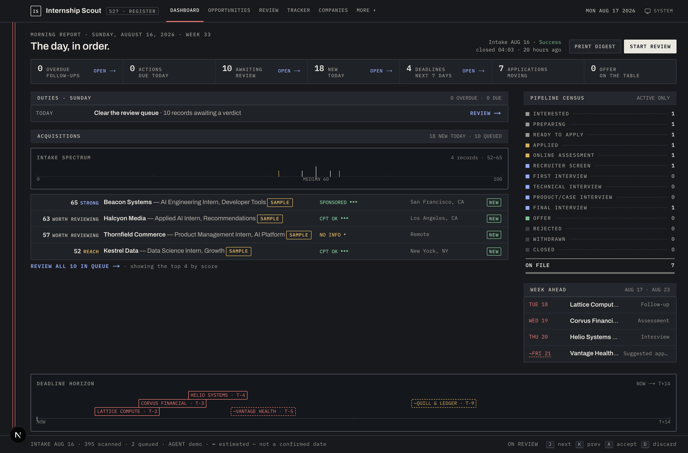
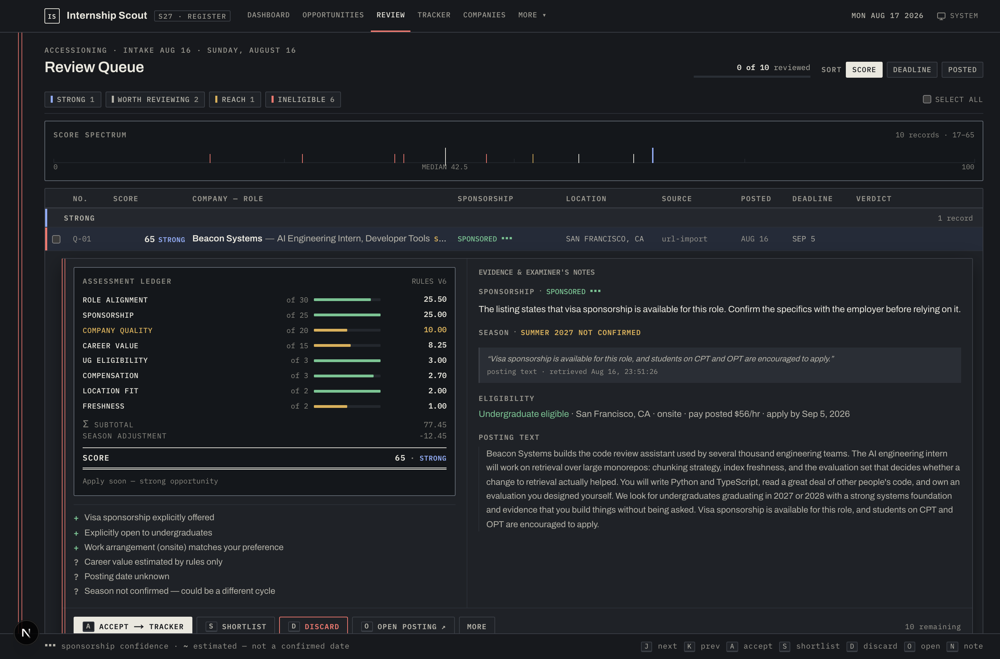
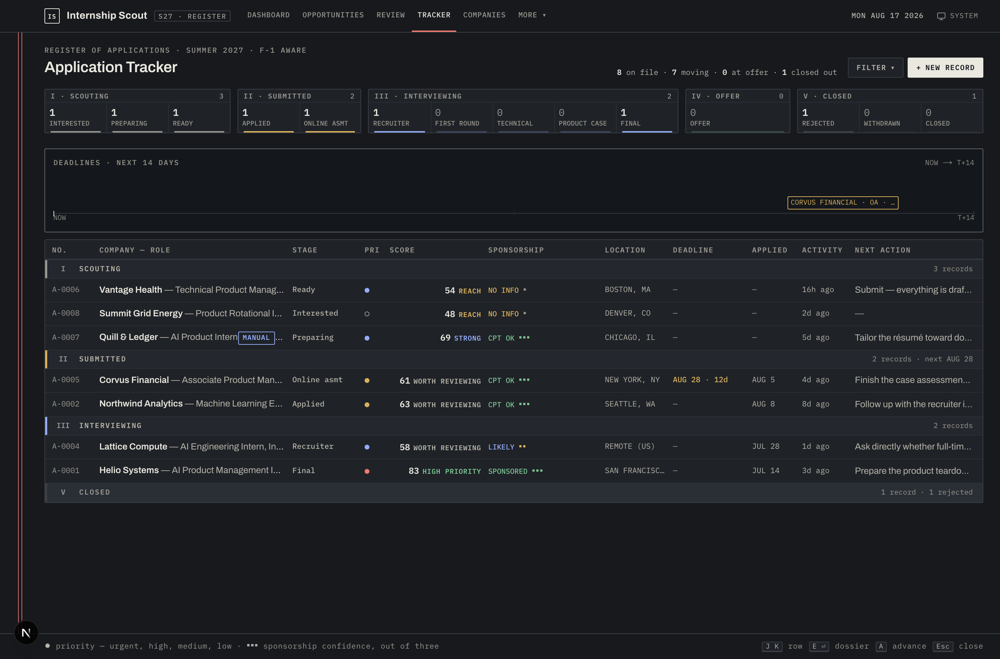
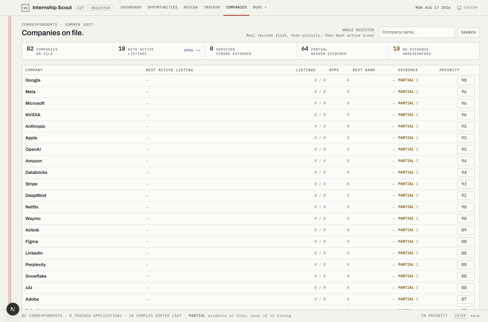
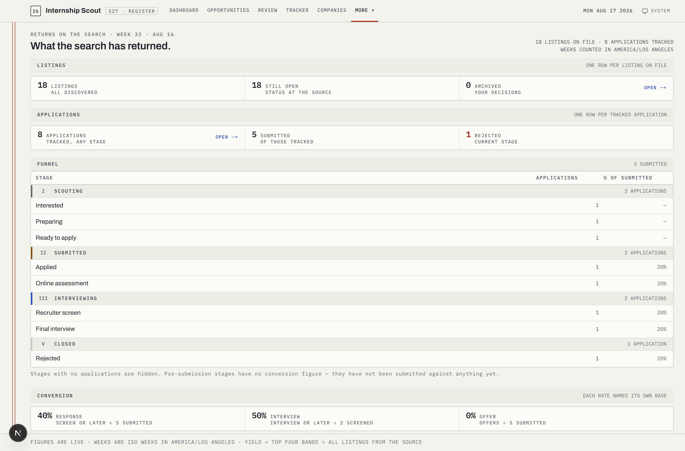

# Internship Scout

A decision tool for an internship search that got too big to hold in a spreadsheet.

It reads job postings, scores them against a weighted rubric, works out what each
one says about visa sponsorship, and puts the survivors in a review queue where
each one takes about ten seconds to judge. What you accept becomes an application
the tracker follows to its outcome.

**[→ Open the live demo](https://internship-scout-internship-rod.vercel.app)** — no
sign-in, nothing to install. The companies and postings are invented; the scores
attached to them are not. Every band, component breakdown and sponsorship verdict
you see was computed by the rules in this repository when the demo was seeded.



---

## The problem it solves

An international student on an F-1 visa has a search with a hard filter in it. A
posting that requires citizenship or an active security clearance is not a long
shot — it is impossible, and reading forty of them a week is expensive. But the
language is slippery. "We do not sponsor visas" usually means H-1B, which a CPT
internship does not need, so treating it as a rejection throws away good roles.
"Sponsorship may be considered" is not a promise. Silence is the most common case
of all, and the honest answer to silence is *we don't know*, not a guess.

So the interesting part of this project is not the scoring. It is refusing to
invent verdicts the text does not support, while still being decisive enough to
save the reader time.

## How a posting gets scored

Eight weighted components, summed to 0–100, then placed in a band:

| Component | Default weight | What moves it |
|---|--:|---|
| Role alignment | 30 | How close the role is to the target category |
| Sponsorship | 25 | The verdict from the rules below |
| Company quality | 20 | Priority tier and sponsorship-filing history |
| Career value | 15 | Signals read out of the posting body |
| Undergrad eligibility | 3 | Explicit undergrad language, class-year requirements |
| Compensation | 3 | Pay type and rate, normalised to hourly |
| Location fit | 2 | Against the preferred work arrangement |
| Freshness | 2 | How long the posting has been up |

The scorer is a pure function. The same posting and the same weights always
produce the same score, which is what makes the review queue trustworthy: two
listings a point apart are a point apart for a reason you can read.

Every score arrives with its own explanation — the component breakdown, the
positives, the concerns, and what is simply unknown:



### The sponsorship rules

A layered matcher over the posting text, in strict precedence order:

1. **Hard gates** — citizenship requirements, active security clearance, demands
   for permanent unrestricted work authorisation. These reject, and nothing
   downstream can soften them.
2. **Positive signals** — an explicit offer of sponsorship, or CPT/OPT language.
3. **Possibility, not promise** — "sponsorship may be considered" is recorded as
   `FUTURE_POSSIBLE` and never counted as a yes.
4. **Flag, don't reject** — a bare "no sponsorship" on an *internship* is
   flagged rather than rejected, because the phrase almost always refers to
   H-1B. This distinction alone keeps genuinely open roles in the queue.
5. **Silence** — `NO_INFO`. Not a guess.

Every verdict carries the verbatim quote it was drawn from, so the reader checks
the tool's work rather than trusting it. The rules are covered by their own test
file; the tricky ones exist because they were wrong once.

## What else is in here

**Deduplication** — the same job is posted to four places with four different
titles. Listings are keyed on a normalised company, title, season and location,
with URL and ATS-job-id matching layered on top.

**A tracker** that follows an application through fourteen stages, keeps a dated
history of every transition, and surfaces what is actually due:



**A company knowledge base** built from public H-1B disclosure data, used as a
*weak* signal — historical filings never imply any particular offer is sponsored,
and the UI says so:



**Analytics** over the funnel — where applications die, and how the score bands
actually performed:



## Running it

You need Node 22+ and Docker (for Postgres — or point `DATABASE_URL` at any
Postgres you like).

```bash
git clone https://github.com/rfbert/internship-scout.git
cd internship-scout
cp .env.example .env
docker compose up -d
npm install
npm run db:deploy && npm run db:seed
npm run dev
```

Then open http://localhost:3000. The seed loads the demo dataset — invented
companies, invented postings, scored on the spot by the real engines. Nothing in
it came from a real search.

### Deploying a copy

`vercel.json` runs [`scripts/vercel-build.sh`](scripts/vercel-build.sh), which
migrates and seeds before building — so pointing this repository at an empty
database is enough to bring up a populated demo. The seed is idempotent, so
redeploys reuse the dataset rather than stacking a second copy of it.

Migrations run over the provider's *direct* connection string when one exists
(`DATABASE_URL_UNPOOLED` / `POSTGRES_URL_NON_POOLING`), falling back to
`DATABASE_URL`. Prisma Migrate takes an advisory lock, which cannot survive a
transaction-mode pooler; runtime still uses the pooled `DATABASE_URL`.

### Demo mode

Set `DEMO_MODE=1` and the app becomes safe to hand to strangers. It stays
usable — work the review queue, move applications through the tracker, write
notes, import a posting — because a demo you cannot use is a screenshot. What
it refuses is the small set of actions that are *global* rather than
per-record: rewriting the scoring weights (one visitor would re-rank every
listing for every later visitor), editing the source registry, deleting
records, and clearing the sample data.

`POST /api/demo/reset` puts everything back by truncating and re-running the
seed, so the dataset is rebuilt by the engines rather than restored from a
dump. It is exposed as a button on the Settings page and runs nightly on a
cron. Both are inert unless `DEMO_MODE` is on, and the reset function refuses
to run without it too — a guard only at the edge is one careless import away
from being bypassed.

## Tests

```bash
npm test              # unit — the engines, the formatters, the view models
npm run test:integration   # API routes against a real Postgres
npm run check:contrast     # asserts WCAG AA in both themes, no browser needed
```

CI runs all of these on every push against a Postgres service container, plus a
production build.

## Stack

Next.js 16 (App Router, React 19, Server Components), TypeScript in strict mode,
Prisma 6 over PostgreSQL, Tailwind 4, Vitest, Playwright.

The schema is user-scoped throughout, so this is single-user by construction but
not single-user by assumption — adding real auth is a middleware change, not a
migration.

## What is deliberately not in this repository

This is the product and its decision engine. The deployment that runs against my
own search also has a scheduled collector that pulls from job boards, adapters
for several applicant tracking systems, an optional LLM pass that refines
ambiguous readings, and a mailer. Those live privately.

Two things worth saying about that:

The scoring you see here is the whole scoring. In the full deployment the model
pass can *reshape* an ambiguous sponsorship verdict and refine a role category,
but it was never allowed to touch the hard gates — the deterministic rules keep
sole authority over rejection. Running rules-only, as this repository does, is a
supported mode there too, not a crippled build.

And the pages that visualise collection — sources, runs, reports — are still here
and still render, from seeded history rather than a live collector. They are part
of the interface, and cutting them would have misrepresented the product.

## Licence

MIT. See [LICENSE](LICENSE).
