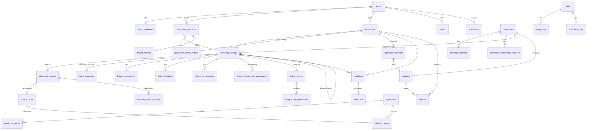

# Entity-relationship overview

Authoritative schema: `prisma/schema.prisma` (33 models). Grouped views below.

Key integrity rules

- `internship_listings.dedupe_key` unique for canonical rows; merged duplicates
  carry NULL key + `canonical_id`/`duplicate_group_id`.
- `internship_sources` unique `(data_source_id, url)` — one sighting row per URL
  per connector; re-fetches append `internship_source_records`.
- `user_listing_decisions` unique `(user_id, listing_id)`; state transitions keep
  `previous_state` + timestamps.
- `applications` unique `(user_id, listing_id)`; stage changes append
  `application_status_history` (history is never overwritten).
- `listing_sponsorship_assessments` / `listing_scores` unique
  `(listing_id, analysis_version)` — re-runs don't duplicate analyses.
- `email_reports` unique `(report_date, kind)` — hard idempotency for the daily email.
- Soft deletion: `deleted_at` on companies, listings, applications, contacts.
